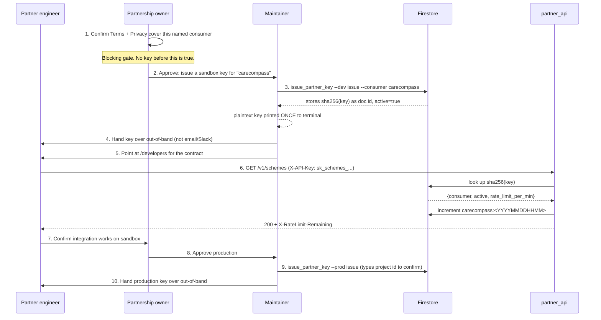
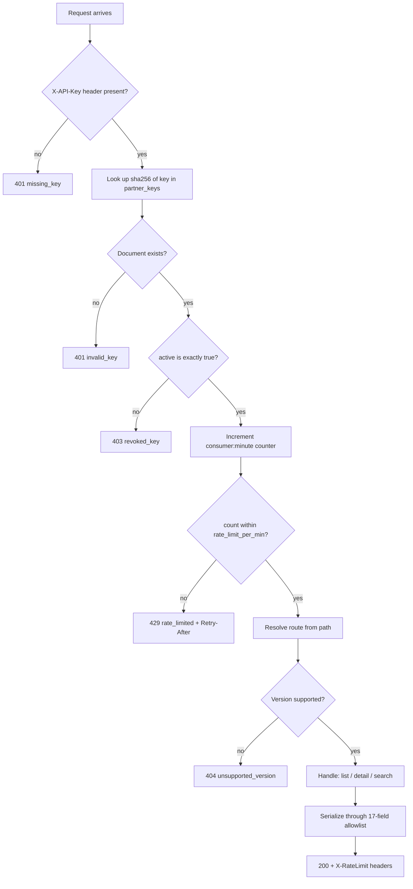

# Partner API — how access actually works

Who does what, in what order, and what a partner does and doesn't get. The
request/response **contract** lives on [`/developers`](https://schemes.sg/developers);
the **operational commands** live in [`partner-api-runbook.md`](partner-api-runbook.md).
This document is the process between them.

## The short answer

- A partner authenticates by putting one opaque key in an `X-API-Key` header on
  every request. Nothing else — no login, no token exchange, no expiry.
- **The partner cannot generate their own key.** There is no signup, no
  self-serve portal, no OAuth app registration. We mint it by hand and hand it to
  them.
- They get exactly one string, once. We cannot retrieve it again afterwards, and
  neither can they.

Partners integrate against **production** (`schemessg`). They also get a sandbox
key on the dev project (`schemessg-v3-dev`) to build against first; the two keys
are not interchangeable, and dev carries no availability promise. See the runbook's
[environments section](partner-api-runbook.md#which-environment-do-partners-actually-get).

## Actors

| Actor | Role |
| --- | --- |
| **Partner engineer** | Integrates against the API. Never touches Firebase. |
| **Partnership owner** | Owns the relationship and the legal gate. Decides *whether* a partner gets access. |
| **Maintainer** | Has Firebase service-account credentials. Runs the CLI that mints the key. |
| **`partner_api`** | The function. Checks the key on every request, then routes. |

## Onboarding, end to end



### 1. The legal gate comes first

Before any key exists, the Terms of Use and Privacy Policy must cover **this
named consumer** and state that scheme data is shared with third-party partners
via API.

Building and testing the mechanism does not need this. Issuing a key to a real
organisation does. This is the one step in the flow that is not technical and not
skippable.

### 2–3. A maintainer mints the key

```bash
cd backend/functions
uv run python -m scripts.issue_partner_key --dev issue --consumer carecompass
```

This requires Firebase service-account credentials, so only a maintainer can do
it. It writes one document to the `partner_keys` collection:

| Field | Value |
| --- | --- |
| *document id* | `sha256(key)` — **not** the key |
| `consumer` | `carecompass` |
| `active` | `true` |
| `created_at` | timestamp |
| `rate_limit_per_min` | `600` |

The key itself is `sk_schemes_` + 32 random bytes (`secrets.token_urlsafe`), 256
bits of entropy, 54 characters:

```
sk_schemes_<43-char-url-safe-random-string>
```

(Deliberately not a realistic-looking sample — a plausible key in a committed
file trips secret scanning and trains people to wave the alert away.)

**It is printed once and never stored.** A dump of the whole `partner_keys`
collection yields no usable credential, because only the hash is there.
Sandbox first is deliberate: the partner builds against `schemessg-v3-dev` data
and cannot touch production until the integration is proven.

### 4. Handover is out-of-band

Not plaintext email, not Slack — anywhere it lingers in a searchable archive. Use
whatever channel the partnership owner already uses for credentials.

If the key is lost in transit or never arrives, **there is no recovery path**.
Revoke and issue a new one; that is the only option, by design.

### 5–6. The partner integrates

They read `/developers` and send the key as a header on every request:

```bash
curl "https://asia-southeast1-schemessg.cloudfunctions.net/partner_api/v1/schemes?limit=5" \
  -H "X-API-Key: $SCHEMES_API_KEY"
```

One key covers all three operations. There is no per-endpoint scoping.

## What happens on every single request



Three things worth naming:

**Auth is checked before anything else.** An unauthenticated request never
reaches routing, never reads a scheme, and never spends rate-limit budget.

**Rate-limit budget is spent even by errors.** A `404` for a bad path still
consumes one request from the minute's budget, because the counter increments
before routing. A partner hammering a wrong URL will throttle itself.

**A revoked key is `403`, not `401`.** That distinction is deliberate: it tells a
partner "you existed and were turned off", which is a different support
conversation from "we've never seen this key".

## Rate limiting, as a partner experiences it

One budget per consumer per minute, **shared across all three operations** —
spending it on `/v1/schemes` also exhausts `/v1/schemes/search`. Every response
carries:

| Header | Meaning |
| --- | --- |
| `X-RateLimit-Limit` | the consumer's configured per-minute ceiling |
| `X-RateLimit-Remaining` | what's left in the current minute |
| `Retry-After` | on a `429` only — seconds until the window resets |

Counters live in `partner_rate_limits`, one document per consumer per minute
(`carecompass:202609011405`), reaped by a Firestore TTL policy.

The window is a fixed calendar minute, not a sliding one, so a partner can send
up to `2 × limit` across a window boundary. Fine at current partner counts;
noted so nobody is surprised by it.

## Lifecycle events

| Situation | What happens | Partner sees |
| --- | --- | --- |
| **Partner loses the key** | Revoke, issue a new one. No recovery — the plaintext never existed on our side. | `403` on the old key once revoked |
| **Rotation** | No in-place rotation. Issue a second key, partner cuts over, then revoke the first. Both work during the overlap and share one budget. | uninterrupted |
| **Revoke access** | `issue_partner_key --prod revoke --consumer <name>`, or flip `active: false` in the console. Effective on the **next request** — no redeploy. | `403 revoked_key` |
| **Pause without revoking** | Set `rate_limit_per_min: 0`. Every request throttles. Reversible by restoring a real limit. | `429 rate_limited` |
| **Raise/lower their limit** | Edit `rate_limit_per_min` on their document. | new ceiling in `X-RateLimit-Limit` |
| **A scheme is retired and merged** | Detail returns `404` with code `scheme_retired` **and** a `merged_into` id. | can follow the move instead of holding a dead id |
| **A scheme goes inactive or retired** | Disappears from list and search, and its detail returns `404`. | fewer results |

Revocation never touches the Firebase Auth users that every anonymous browser
session depends on — partner identity lives in its own collection with its own
gate, precisely so that a partner action can't affect site visitors.

## What we can see

```bash
uv run python -m scripts.issue_partner_key --prod list
```

Lists consumer, active flag, rate limit, creation time, and a hash prefix.
Plaintext keys are deliberately unrecoverable, so this is an audit view, not a
credential store. Per-consumer usage is visible in `partner_rate_limits` and in
the function logs.

## What a partner deliberately does not get

| Not provided | Why |
| --- | --- |
| Self-serve signup / key generation | Each key is issued by hand so we know who holds the data and can reach them when something changes. That's the point, not an unfinished feature. |
| A dashboard or usage portal | Nothing to log into. Ask us and we'll read the counters. |
| OAuth / JWT / short-lived tokens | A single long-lived key is proportionate to read-only access to already-public scheme data by a handful of named partners. |
| Write access of any kind | The API is read-only. There is no endpoint that mutates anything. |
| CORS headers | CORS is enforced by browsers, not servers, so a partner's backend ignores it and needs none. Its absence is the control: browser use would require shipping their secret key to end users, and the missing headers make that fail in development rather than leak in production. **Partner domains must not be added to `ALLOWED_ORIGINS`.** Frontend access belongs behind the partner's own backend — see the runbook's CORS section. |
| An SLA, status page or OpenAPI spec | Real concerns for a mature public API; not proportionate to the current partner count. |
| Key expiry | Keys don't auto-expire. Revocation is manual and immediate. Worth revisiting if the partner count grows. |

## Field visibility

Partners receive exactly 17 allowlisted fields, built by an explicit mapper
rather than by dumping the Firestore document. Adding a field to a scheme
document cannot silently join the partner contract.

`phone` and `email` **are** included — these are published organisation contact
details, which is the whole point of surfacing a scheme to someone who needs
help. Internal fields (`approved_by`, `scraped_text`, `source_entry_id`,
`search_booster`, link-check metadata) are unreachable through every operation,
asserted in both unit tests and the end-to-end smoke run.
