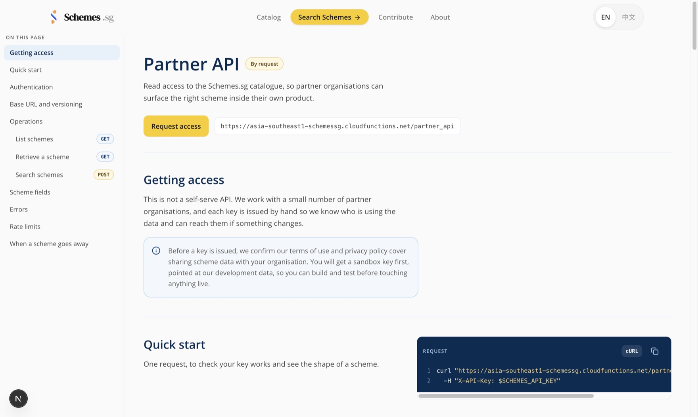
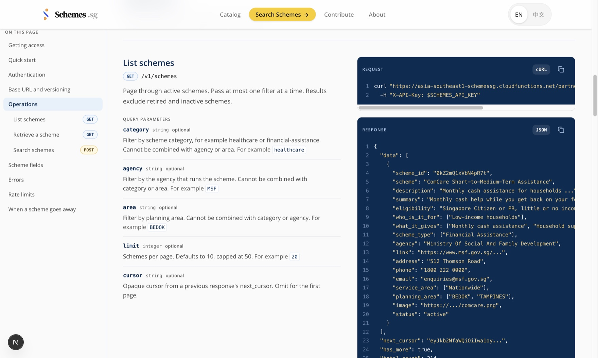
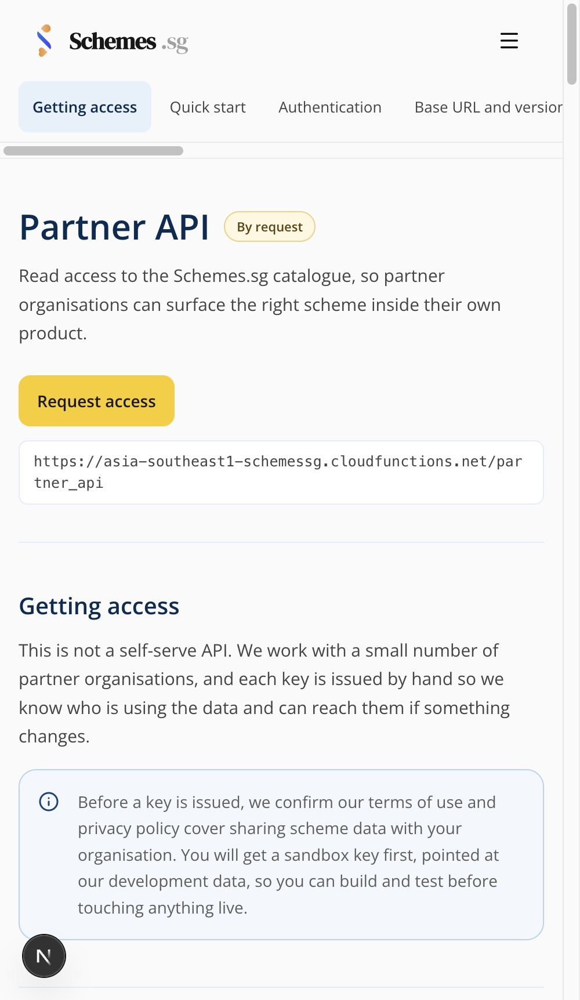
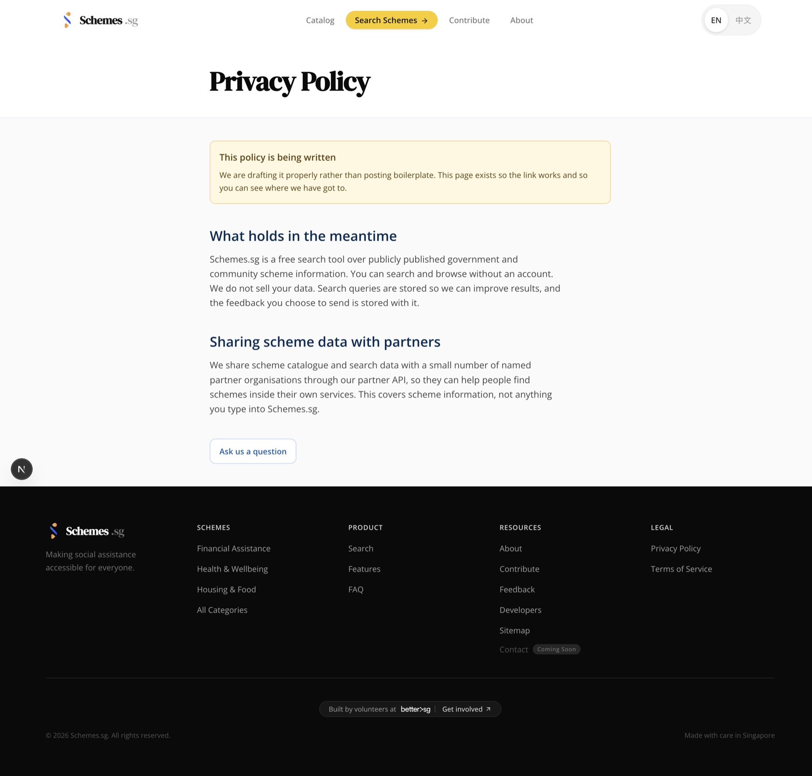
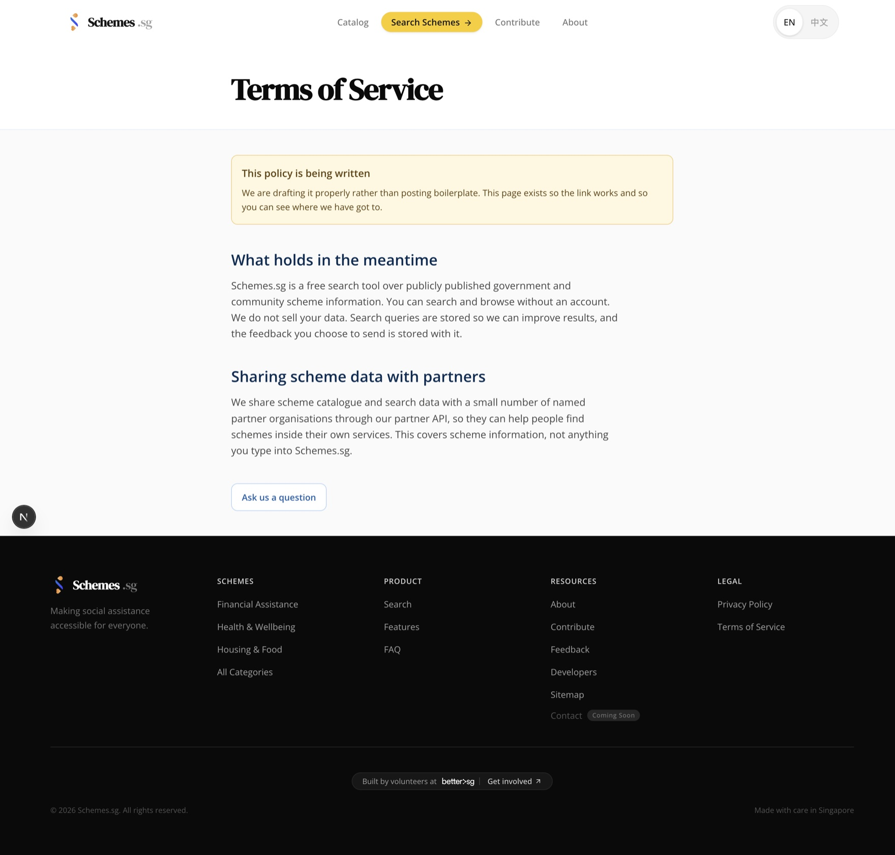

# Partner API — verification record

Proof of work for the partner API branch (`feat/partner-api-access`). Everything
below was executed, not asserted. Commands are runnable from a clean checkout.

## Status summary

| Gate | Result |
| --- | --- |
| Backend unit + integration tests | **310 passed**, 0 failed |
| `partner/routing.py` coverage | **100%** |
| `partner/serializers.py` coverage | **100%** |
| `partner/search.py` coverage | **100%** |
| `utils/partner_auth.py` coverage | **100%** |
| `partner/api.py` coverage | 65% (remainder is the HTTPS entrypoint and response plumbing) |
| `schemes/catalog.py` coverage | 94% |
| Frontend typecheck (`tsc --noEmit`) | clean |
| Frontend production build | clean, 3 new routes prerendered static |
| Frontend lint | 0 findings in new files (29 pre-existing warnings unchanged) |
| Ruff on changed backend files | clean |
| Adversarial code review (45 agents, 7 dimensions) | 19 raised → 4 confirmed → **all 4 fixed** |
| Docker compose smoke (real HTTP + dev Firestore) | **27/27 checks passed** |

## Backend tests

```bash
cd backend && uv run pytest
```

```
310 passed, 1 warning in 10.55s

functions/partner/api.py            97   34   65%
functions/partner/routing.py        36    0  100%
functions/partner/search.py         26    0  100%
functions/partner/serializers.py     8    0  100%
functions/utils/partner_auth.py     37    0  100%
functions/schemes/catalog.py       135    8   94%
```

Baseline before this branch was 278 tests; the branch adds 32.

## The shared-helper change is behaviour-preserving for `/catalog`

`schemes/catalog.py` is shared with the frontend catalog, so the partner list
needed to hide `inactive` without changing what `/catalog` shows.
`_get_listed_paginated_results` now takes `exclude_statuses`, defaulting to
`frozenset({retired})` — exactly what `/catalog` hid before.

The pre-existing test that pins the old behaviour still passes unmodified:

```python
# tests/unit/test_scheme_retirement.py::test_catalog_filters_retired_schemes
assert [item["scheme_id"] for item in result.data] == ["legacy", "active", "inactive"]
#                                                                        ^ still kept for /catalog
```

## Lazy-import boundary

`partner/api.py` keeps the embeddings stack out of its own import graph:

```bash
cd backend/functions && uv run python -c "
import partner.api, sys
print([m for m in ('search.retriever','torch','sentence_transformers','faiss') if m in sys.modules] or 'NONE')"
```

```
NONE
```

**Honest caveat, measured:** this does not make a real cold start cheaper today.
`main.py` imports `agent.handler` at module scope, which reaches
`search.retriever` through `agent/engine.py → router.py → tools/search.py`:

```bash
cd backend/functions && uv run python -c "
import main, sys
print([m for m in ('search.retriever','torch') if m in sys.modules])"
```

```
['search.retriever']
```

Since Firebase loads one `main.py` per deployment, every function already pays
that import. The lazy import is the half this branch controls, and it is guarded
by a test so nothing hoists a search import into the partner path. Making the win
real means deferring `agent.handler`'s import — a separate change to an existing
endpoint, deliberately not in this PR.

## Frontend

```bash
cd frontend && npx tsc --noEmit && npm run build && npm run lint
```

```
✓ Compiled successfully in 3.4s
├ ○ /developers
├ ○ /privacy
└ ○ /terms
```

`○` = prerendered static. Lint reports 0 findings in the new files; the 29
warnings are pre-existing and unchanged from `origin/stg`.

### Rendering, verified in a real browser

Screenshots captured over CDP against the dev server, not asserted from markup:

| Shot | What it shows |
| --- | --- |
| [`01-developers-desktop.jpg`](evidence/partner-api/01-developers-desktop.jpg) | `/developers` at 1440px — header, pinned sidebar, first sections |
| [`02-developers-operations.jpg`](evidence/partner-api/02-developers-operations.jpg) | The operations reference: params left, request and response panels right |
| [`03-developers-errors-and-fields.jpg`](evidence/partner-api/03-developers-errors-and-fields.jpg) | Field table, error table and rate-limit headers |
| [`04-developers-mobile.jpg`](evidence/partner-api/04-developers-mobile.jpg) | `/developers` at mobile width, after both layout fixes below |
| [`05-privacy.jpg`](evidence/partner-api/05-privacy.jpg) | `/privacy` |
| [`06-terms.jpg`](evidence/partner-api/06-terms.jpg) | `/terms` |

Captured at native retina (2880px) and resampled to 1760px wide — twice GitHub's
render column, so text stays sharp. An earlier pass used `sips -Z`, which caps the
*longest* side and therefore squashed a tall full-page capture to 293px wide and
unreadable; width-constrained resampling is the fix.

Console on `/developers`: no errors or warnings from page code.

**`/developers`, desktop at 1440px** — Stripe-style reference arrangement in the
Schemes.sg palette: pinned section sidebar with method badges, prose left, dark
`--schemes-blue-900` code panels right.





**`/developers`, mobile** — horizontally-scrolling section strip sitting below the
navbar, after both layout fixes below.



**`/privacy` and `/terms`** — interim pages, honest about being drafts.





### Two mobile layout bugs found this way and fixed

Both were invisible to tests, typecheck, lint and the build. Measured in-page:

**1. 16px horizontal overflow.** The sidebar's `<ul>` used the full-bleed
`-mx-4 px-4` trick, but its parent `<nav>` had no horizontal padding (the padding
lives on the sibling content column), so the strip hung 1rem past the viewport:

```
before: viewport 500, docScrollWidth 516, ulBox {left: -16, right: 516}
after:  viewport 500, docScrollWidth 500, ulBox {left: 0,   right: 500}
```

Fixed by moving the padding onto the `<nav>` and matching the negative margin per
breakpoint. Verified flush at base (`-16px` vs `16px`) and `sm` (`-32px` vs
`32px`), and unchanged at `lg` (`mx-0`, column flex, sticky 256px rail).

**2. Section strip collided with the fixed navbar.** The strip rendered at `y=0`,
under the site header, because only the content column carried the top offset:

```
before: stripContentTop 0,  navbarBottom 70   ← overlapping
after:  stripContentTop 70, navbarBottom 70, h1Top 162
```

Fixed so the offset applies exactly once per layout (`pt-nav` on the nav below
`lg`, `lg:pt-nav` on the header at `lg`). Desktop unchanged: `h1Top 110`,
`sidebarHeadingTop 70`, zero overflow.

## Adversarial code review

7 dimensions reviewed in parallel, every finding then attacked by 2 independent
verifiers instructed to refute it and to default to "refuted" when uncertain.

```
19 raw findings → 4 confirmed, 15 refuted   (45 agents, 0 errors)
```

All 4 confirmed findings are fixed in this branch:

| Severity | Finding | Fix |
| --- | --- | --- |
| blocker | `POST /v1/schemes/search` returned `500 internal_error` for any valid-JSON body that wasn't an object (`["a"]`, `"hi"`, `5`) — `body.get()` raised `AttributeError` | Validate the body is an object, before the lazy import, so a bad body is a `400 invalid_request` and costs no embeddings load |
| major | List route filtered `inactive` *after* pagination → short pages and a `total_count` counting schemes the API never returns | Pass `exclude_statuses` into the shared helper so the refill loop and count both honour it |
| major | Smoke script's own 8/min budget was spent before the DETAIL and SEARCH checks, so it reported failures against a correct API | Functional key gets headroom; throttling proved on a separate key under its own consumer |
| major | No test covered `_handle_list`, which is how the pagination bug shipped | Added refill, `total_count`, and param-validation tests |

The review also confirmed the fix matches repo convention: the sibling
`schemes/search.py:60-75` already wraps the same `body.get(...)` calls and
returns 400, so the 500 was a regression against existing practice.

Additional hardening applied while in the area (these findings were *refuted* as
unreachable through supported operations — kept anyway because they fail open at
a revocation gate, and the runbook tells operators to hand-edit these fields):

- Only a real boolean `true` authenticates. A hand-typed `"false"` is truthy and
  would previously have kept a revoked key working.
- `rate_limit_per_min: 0` is honoured instead of collapsing to the default
  via `or`. Documented in the runbook as the pause-without-revoking control.
- A non-numeric `rate_limit_per_min` falls back to the default instead of raising
  a 500 on every request.
- Auth and rate-limiting are wrapped, so a Firestore blip answers in the
  documented error envelope rather than a bare 500.

## End-to-end smoke test

Run against the docker compose emulator serving the real function, backed by the
`schemessg-v3-dev` cloud Firestore (vector search needs real Firestore, so
`FIRESTORE_EMULATOR_HOST` stays commented out).

```bash
cd backend && docker compose -f docker-compose-firebase.yml up --build
# second shell:
cd backend/functions && uv run python -m scripts.smoke_partner_api --json ../../.evidence/smoke.json
```

```
27/27 checks passed
```

Full transcript in [`evidence/partner-api/smoke-run.txt`](evidence/partner-api/smoke-run.txt),
machine-readable report in [`evidence/partner-api/smoke-report.json`](evidence/partner-api/smoke-report.json).

What it proved over real HTTP, beyond what unit tests can reach:

| Area | Evidence from the run |
| --- | --- |
| Auth | missing key → `401 missing_key`; unknown → `401 invalid_key`; revoked → `403 revoked_key` |
| Versioning | `/schemes` and `/v2/schemes` → `404 unsupported_version`; never falls through to an implicit v1 |
| Method + reserved path | `POST /v1/schemes` → 405; `GET /v1/schemes/search` → 405, not a detail lookup for a scheme named "search" |
| List | 200 with 5 schemes, `total_count=450`, `has_more=true` |
| Filtering | `category='Financial Assistance'` → 200, `total_count=169`; unknown category → `400` |
| Detail | real id → 200 (`Family Justice Support Scheme (FJSS)`); unknown id → `404 not_found` |
| Search | 200 with 5 results, `total_count=83`; empty query → `400` |
| **No data leakage** | `approved_by`, `scraped_text`, `source_entry_id`, `search_booster` absent from list, detail *and* search payloads |
| **Allowlist is exact** | every payload carried exactly the 17 allowlisted fields — no extras |
| Lifecycle | no `retired` or `inactive` scheme in any list or search response |
| **Blocker fix** | `non-object JSON body is 400, not 500` — the bug the review found, confirmed fixed over the wire |
| **Rate-limit fix** | `X-RateLimit-Limit=200` on the functional key, so the run no longer starves itself; throttle key → `429 rate_limited` with `Retry-After=60` |

Cleanup verified afterwards: `partner_keys` back to 0 documents, no leftover
rate-limit buckets.

### One thing this run itself caught

The first run scored 26/27. The failure was in the smoke script, not the API: it
filtered on `category=healthcare`, which is not a real category, and the API
correctly answered `400 invalid_request: Unknown category: 'healthcare'`. The
check now derives a category from `SCHEME_CATEGORY_MAPPING` instead of hardcoding
one, so renaming a category updates the check instead of silently asserting a 400,
and an explicit unknown-category check was added alongside it.

Separately, the documented invocation `python scripts/smoke_partner_api.py` failed
with `ModuleNotFoundError: No module named 'partner'` — a standalone script does
not get `functions/` on `sys.path`. Both scripts and all docs now use the repo's
existing convention, `python -m scripts.<name>` (as `run_link_check_and_reindex.py`
already did).
